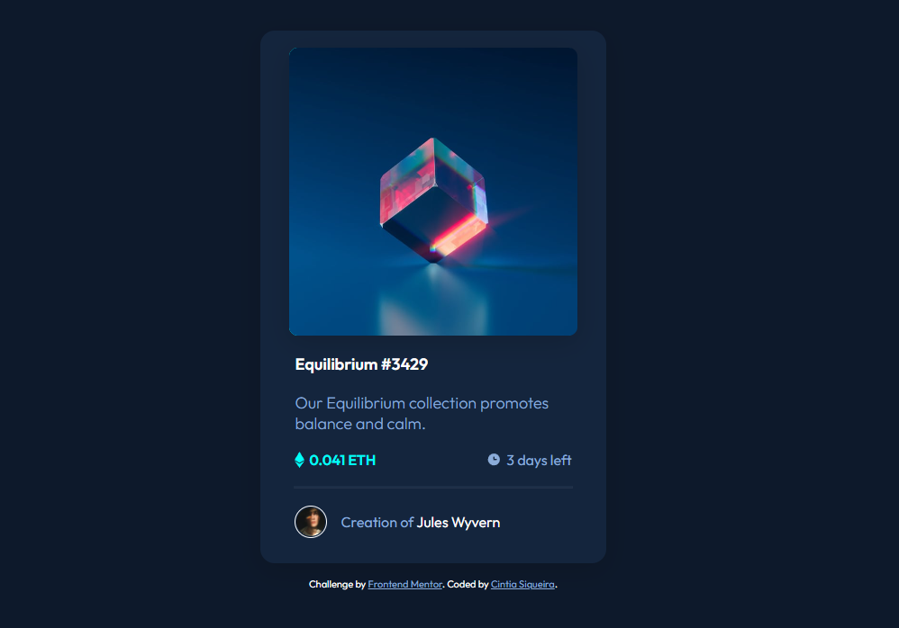

# Frontend Mentor - NFT preview card component solution

This is a solution to the [NFT preview card component challenge on Frontend Mentor](https://www.frontendmentor.io/challenges/nft-preview-card-component-SbdUL_w0U). Frontend Mentor challenges help you improve your coding skills by building realistic projects.

## Table of contents

- [Overview](#overview)
  - [The challenge](#the-challenge)
  - [Screenshot](#screenshot)
  - [Links](#links)
- [My process](#my-process)
  - [Built with](#built-with)
  - [What I learned](#what-i-learned)
  - [Continued development](#continued-development)
  - [Useful resources](#useful-resources)
- [Author](#author)
- [Acknowledgments](#acknowledgments)

## Overview

### The challenge

Users should be able to:

- View the optimal layout depending on their device's screen size
- See hover states for interactive elements

### Result Screenshot



### Links

- Solution URL: [Click here](https://github.com/ciisiq/challenge-preview-card-component)
- Live Site URL: [Click here](https://ciisiq.github.io/challenge-preview-card-component/)

## My process

### Built with

- Simple Html
- CSS simple
- Flexbox

### What I learned

I learned about (and I need to understand more about it), <hr> tag for to create a simple line, to make a hover above image as a lit trick to me I used the background and another layer to do this

```html
<div class="layer" style="background-color: var(--cyan);"></div>
```

```css
.proud-of-this-css {
  object-fit: cover;
  position: absolute;
}
```

### Continued development

Like I said before I need to understand more about HR and how to use background-image with URL and hot to make a simple hover without maybe to many DIV

### Useful resources

- [Example resource 1](https://www.youtube.com/watch?v=xZHOYh0dnPw) - Where I found a way to make a responsive hover without use a fixed position.
- [Example resource 2](https://www.w3schools.com/tags/tag_hr.asp) - About styling HR

## Author

- Website - [Cintia Siqueira](https://cisiq.dev/)
- Frontend Mentor - [@ciisiq](https://www.frontendmentor.io/profile/ciisiq)
- Twitter - [@Cii_siq](https://twitter.com/Cii_siq)

## Acknowledgments

Doing anything is better than nothing ☺️🙌🏻
